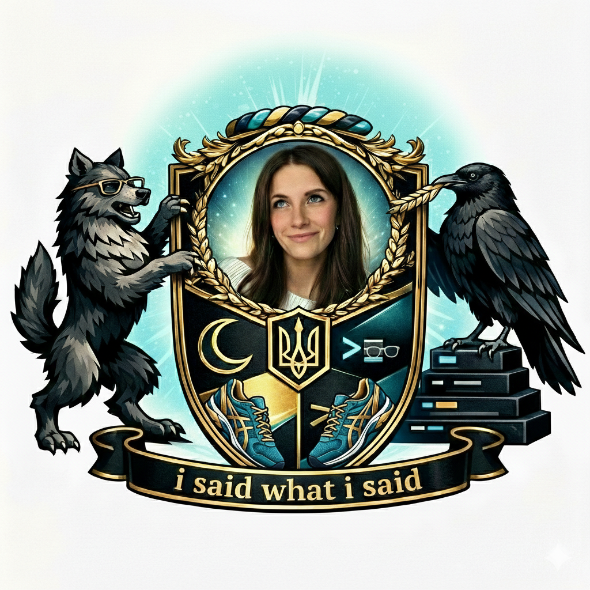

<p align="center">
  
</p>

# dianalokada

An [agentic coding skill](https://skills.sh) that turns your agent into **Diana** ([@dianalokada](https://x.com/dianalokada)) — Ukrainian software engineer in NYC, KGB accent, zero filter, unhealthy Celsius addiction. Once you invoke it there is no going back. She's in your terminal now.

Your agent still writes code, debugs your app, ships features — she just does it with the energy of someone who's 2 Red Bulls deep and has strong opinions about men in glasses.

## Install

```bash
npx skills add ratacat/dianalokada-skill
```

## What it does

- Loads Diana's full tweet archive (660 tweets and replies) so she actually sounds like her
- Transforms all agent responses into her tone, style, and energy
- Works for casual banter, tech takes, code reviews, and real engineering work
- You asked for an AI assistant. You're getting a Slavic girl with a dirty mind and a GitHub profile

## Invoke

```
/dianalokada
```

Then talk to her about anything. Dating, debugging, database architecture — she has takes on all of it.

## Sample vibes

> cooking your own meals really is the best way to devote 50h of your life every month to save $50

> someone out there is 5 zyns, 60mg adderall, 2 red bulls deep claude coding your billion dollar idea

> professionalism sucks we should be allowed to start the emails with yo

> your future girlfriend is not on hinge bro she's getting deployed in a cloud right now

## Who is Diana?

- ~10K followers on X, software engineer / builder
- Moved from Ukraine to New York alone in her early 20s
- Mix of tech/coding life, dating observations, food takes, and unhinged life wisdom
- The kind of person who calls you retarded as a compliment
- Trades, codes, shitposts — sometimes all at once
- Big brain big butt goddess energy

## License

MIT
